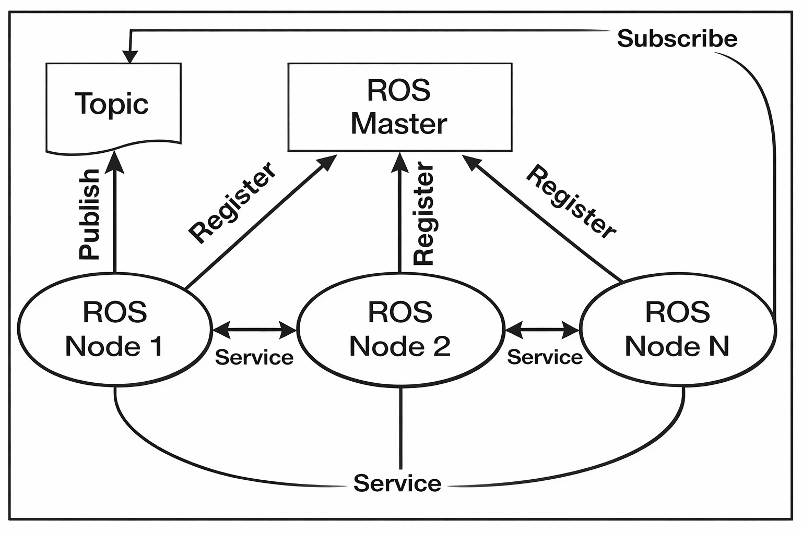

# O que é ROS - Robotic Operating System

O ROS não é um Sistema Operacional, e sim um "Middleware de Comunicação"

### O que é um MiddleWare?
É algo que "fica no meio" entre as aplicões e o SO do robô (linux, já que o ROS 1 só funciona em linux)

O que esse diagrama representa:

- Os ROS Nodes são os programas (ex: controle do drone, câmera, sensores).
- O ROS Master funciona como um “central de registro” — ele não envia dados, só conecta quem quer conversar.
- Os Topics são canais de comunicação onde dados são publicados (ex: imagem da câmera, posição).
- Os Services são chamadas diretas entre nodes (tipo pedido/resposta).

Diante disso, como funciona na prática:
1) Um node avisa o ROS Master: “eu publico neste tópico” ou “quero me inscrever”.
2) O Master conecta os nodes interessados.

Depois disso, os nodes se comunicam diretamente entre si (sem passar pelo Master).

#### Para melhor entendimento, vamos fazer uma analogia com um drone:

No contexto de um drone utilizando ROS, o sistema é dividido em vários componentes chamados nodes, onde cada um é responsável por uma função específica, como capturar imagens, processar dados ou controlar o movimento. Por exemplo, pode existir um node da câmera, que captura imagens do ambiente, um node de visão computacional, que analisa essas imagens, e um node de controle de voo, que toma decisões sobre como o drone deve se movimentar.
Para que esses nodes consigam se comunicar, existe o ROS Master, que atua como um intermediário responsável por organizar essa comunicação. Sendo assim, quando um node inicia, ele informa ao Master quais dados ele publica ou quais dados ele deseja receber e, a partir disso, o Master conecta os nodes interessados, o que permite que eles se comuniquem diretamente entre si, sem precisar passar novamente por ele.
A comunicação entre os nodes pode acontecer de duas formas principais: 
- A primeira é por meio de topics, que funcionam como canais de transmissão contínua de dados. No caso do drone, o node da câmera pode publicar continuamente imagens em um tópico, enquanto o node de processamento se inscreve nesse tópico para receber essas imagens e analisá-las. Após o processamento, esse node pode publicar informações, como a detecção de um objeto ou a posição de uma linha, em outro tópico, que será utilizado pelo node de controle de voo.
- A segunda forma de comunicação ocorre por meio de services, que seguem um modelo de requisição e resposta. Nesse caso, um node faz um pedido específico para outro e aguarda uma resposta, por exemplo, o node de controle de voo pode solicitar a outro node que arme os motores do drone, recebendo uma confirmação após a execução do comando.

Dessa forma, todo o funcionamento do drone acontece de maneira distribuída e organizada, isto é, os nodes executam tarefas específicas, os topics permitem o fluxo contínuo de informações e os services são usados para comandos pontuais, enquanto o ROS Master garante que todos os componentes estejam corretamente conectados.

---
##### Drone
Imagina o drone como um conjunto de “mini programas” (nodes), cada um responsável por uma coisa:

- Node da câmera
- Node de processamento de imagem
- Node de controle de voo
- Node de telemetria

Mas eles precisam se COMUNICAR, e é ai que entra o ROS.

##### Papel do ROS Master:
O ROS Master é tipo um “grupo de WhatsApp” que conecta todo mundo.

A câmera fala: “eu envio imagens no tópico /camera”
O processamento fala: “quero receber /camera”
O Master conecta os dois

Depois disso, eles conversam direto e o Master sai do caminho

##### Comunicação por Topic (fluxo contínuo)

Exemplo:

- Câmera publica imagens → /camera
- Processamento lê essas imagens
Ele detecta uma linha ou obstáculo
Publica resultado → /detected_object

Isso é tipo um stream contínuo de dados

##### Comunicação por Service (pedido/resposta)

Exemplo:

- Controle de voo precisa armar o drone
- Ele faz um pedido: “Armar motores?”

Outro node responde:

- “Ok, armado.”

Isso é tipo uma função que você chama e espera resposta

---