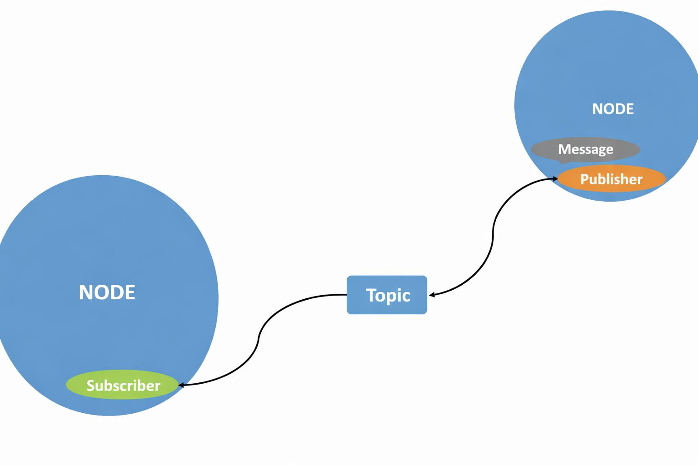
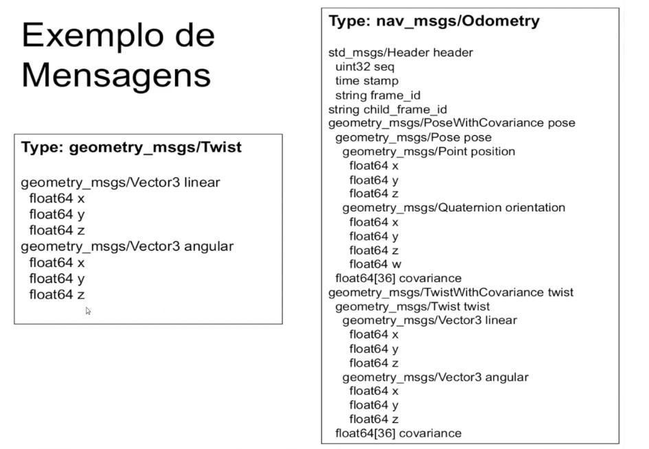
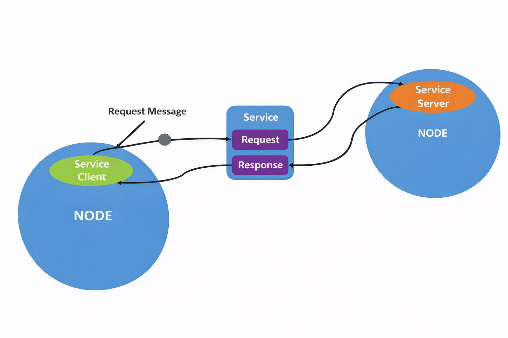

# Conceitos Básicos do ROS: Mensagens, Nós, Tópicos, Pacotes, Serviços e Parâmetros 

O ROS organiza sistemas robóticos distribuídos por meio de uma **estrutura de comunicação padronizada entre processos (nodes)**.
Essa comunicação é coordenada pelo **ROS Master**, que é iniciado com:

```bash
roscore
```

O Master não transporta dados, ele apenas **registra e conecta os nodes**.

## Mensagens
**O que são "Mensagens" no ROS?**
Mensagens são **estruturas de dados padronizadas** usadas para comunicação entre nodes.
- São **publicadas** por um node
- São **recebidas** por outros nodes através de **tópicos**

Os Nodos se subscrevem a Tópicos, para receberem Mensagens quando publicadas por outros Nodos. 



Existe uma grande quantidade de mensagens padronizadas no ROS. Sendo assim, cada mensagem possui um **tipo bem definido**, o que garante consistência na comunicação.

**Principais bibliotecas de mensagens:**
- std_msgs: Mensagens primitivas (int, float, string, time).
- common_msgs: Pacote com os principais tipos de mensagens
    - geometry_msgs: Primitivas geométricas (acceleration, pose2D, twist). 
    - sensor_msgs: Sensores (image, imu, pointcloud, laserscan).
    - nav_msgs: Navegação (gridcells, occupancygrid, path).

Vamos a um exemplo de mensagens: 


Na mensagem geometry_msgs/Twist nos mostra como algo está se movendo, como: 
```text
linear:
  x: 1.0
  y: 0.0
  z: 0.0

angular:
  x: 0.0
  y: 0.0
  z: 0.5
```
Se fosse um drone, podemos entender que ele está indo para frente. 

Já no outro exemplo, nav_msgs/Odometry, já é mais complexo, pois temos tanto posição quanto movimento. 

**OBS:** Twist é só movimento, enquanto Odometry é posição + movimento.


## Nós
**O que são Nós (programas) no ROS?**
Um Nó é um **programa em execução** (é um processo).
Ele pode:
- Publicar mensagens (publisher)
- Receber mensagens (subscriber)
- Fazer ambos
- Oferecer serviços
- Chamar serviços

**ATENÇÃO:** Cada Nó é independente. 

Quando o roscore inicia, não há nenhum programa em execução, apenas o Nó principal de controle do ROS, e cada vez que inicializamos um software (um novo processo), esse é registrado no ROS Master como um Nó. 


## Pacotes
**O que são Pacotes no ROS?**
Pacotes são conjuntos de Nós (Pacotes também podem ter definição de mensagens, serviços, e serem codificados em C/C++, Python, MatLab).
Vamos pensar nos pacotes como pastas organizadas de funcionalidades.

## Tópicos
**O que são Tópicos no ROS?**
Tópicos são **canais de comunicação assíncronos** entre nodes, como se fosse um tubo que liga Nós publicadores com Nós subscritores. 
Dessa forma, quando um Nó do tipo publicador é executado, ele cria um Tópico. 
Cada tópico possui um nome único, e sempre começa com o caractere `"/"`. 
Além disso, cada Tópico só transmite mensagens de um tipo específico, ou seja, na hora de criação do Tópico, precisa especificar qual tipo de mensagem (dados) serão transmitidos dentre os tipos de mensagens existentes, e, caso não encontre o tipo específico, pode-se criar novas mensagens nos pacotes. 

##### Como funciona exatamente? 


Um Nó que é publicador cria um tópico, e um Nó subscritor se registra nesse tópico, dessa forma, todas as vezes que o Nó publicador enviar uma mensagem pelo Tópico, essa mensagem chega até o Nó que se inscreveu nesse tópico, de forma contínua. 
**ATENÇÃO:** A relação não precisa ser 1:1, pode ser 1:N subscritores, ou N:N.


## Serviços
**O que são Serviços no ROS?**
Serviços são outra maneira de fazer os Nós se comunicarem no ROS. 
Um nó pode "prover" serviços, e um nó pode "chamar" o serviço de outro. 



Olhando o diagrama, pode-se concluir que o Serviço é uma comunicação do tipo requisição e resposta, ou seja, um nó pede algo, outro nó responde, e acabou (não é contínuo)


## Parâmetros
**O que são Parâmetros no ROS?**
O ROS permite armazenar/consultar/alterar "parâmetros" de configuração de cada Nó, ou seja, são configurações para alterar a funcionalidade de algum nó. 
Há um "Servidor de Parâmetros" para guardar/consultar/alterar estes parâmetros, que são "globais" e podem ser acessados por todos os Nós. 


## Mais detalhes
Podemos encontrar mais detalhes e explicações em: https://wiki.ros.org/pt_BR