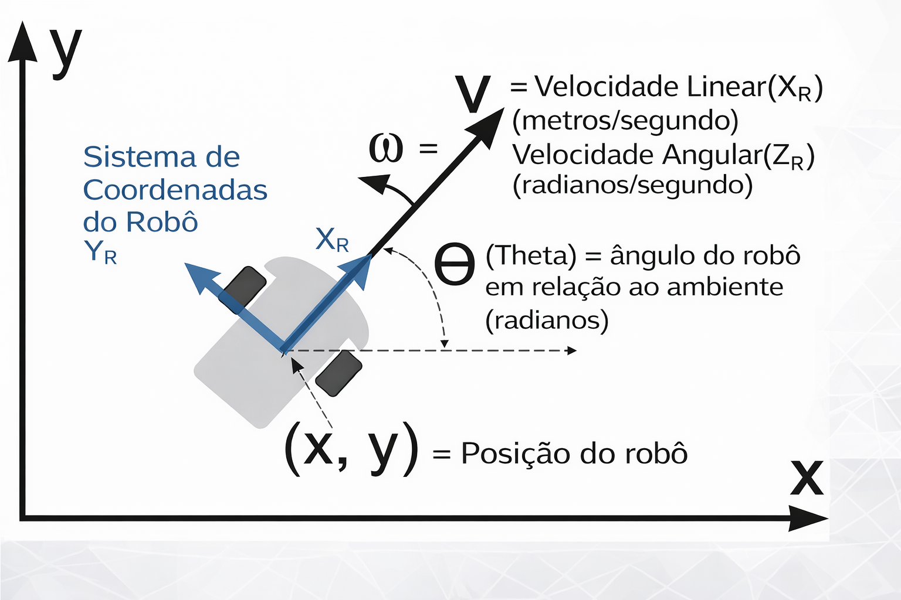

# Comandos de Nós, Tópicos e Mensagens com o TurtleSim

**OBS:** O **Turtlesim** é um pacote simples e didático do ROS, projetado para facilitar o entendimento dos conceitos fundamentais de comunicação entre nodes. Ele fornece uma simulação gráfica de um robô móvel em um ambiente bidimensional, sendo amplamente utilizado nos tutoriais oficiais do ROS para explorar, na prática, como funcionam nós, tópicos e mensagens.

Este resumo será baseado em: 
- https://wiki.ros.org/ROS/Tutorials/UnderstandingNodes
- https://wiki.ros.org/ROS/Tutorials/UnderstandingTopics

## Prática

### Inicialização do sistema
O primeiro passo em qualquer aplicação ROS é iniciar o **ROS Master**, responsável por registrar e conectar os nodes. Isso é feito com:
```bash
roscore
```
Assim, inicializamos o ROS Master, isto é, o sistema ROS passa a funcionar e um node essencial chamado `/rosout` é automaticamente iniciado. Esse node é responsável pelo sistema de logs do ROS, permitindo monitorar mensagens de debug e execução.

Para trabalhar com ROS, é comum utilizar múltiplos terminais, pois cada node roda como um processo separado. Sendo assim, vamos abrir mais uma aba de terminal:
**Ctrl + Shift + T**

### Comandos de Acesso aos Nós: 
Nodes são os programas que executam tarefas específicas dentro do ROS. Para interagir com eles, utilizamos o comando `rosnode`.
Vamos ver todas as possibilidades de comandos de rosnode com:
```bash
rosnode <tab><tab>
```

1) Verificar nós ativos:
```bash
rosnode list
```
Inicialmente, apenas o `/rosout` estará ativo, e à medida que novos nodes são executados, eles aparecem nessa lista.

2) Verificar as informações dos nós:
```bash
rosnode info </nome_nó>
```
Esse comando mostra quais tópicos o node publica, quais ele consome e quais serviços oferece.

3) **Mas como faz para "executar" novos nós do ROS?**
```bash
rosrun <nome_pacote> <nome_nó>
```

Vamos ver um exemplo:

---
#### TurtleSim
```bash
rosrun turtlesim turtlesim_node
```
Ao executar, uma janela gráfica será aberta mostrando uma tartaruga em um plano 2D de aproximadamente 500x500 pixels. A tartaruga inicia no centro do ambiente, com coordenadas próximas de (5.54, 5.54) e orientação 0 radianos.
O modelo simulado é equivalente a um robô diferencial (duas rodas), em que movimentos são definidos por velocidades lineares e angulares. No sistema de referência do ROS, rotações no sentido anti-horário são consideradas positivas.

```text
rosrun turtlesim turtlesim_node 
[INFO] [1776707682.990933792]: Starting turtlesim with node name /turtlesim
[INFO] [1776707683.014320495]: Spawning turtle [turtle1] at x=[5,544445], y=[5,544445], theta=[0,000000]
```



Uma vez executado o comando, se rodarmos "rosnode list", veremos o nó /turtlesim

--- 

### Comandos de Acesso aos Tópicos:
Tópicos são os canais de comunicação por onde os nodes trocam mensagens. Desse modo, para explorá-los, utilizamos o comando `rostopic`.

Podemos verificar todas as possibilidades de comandos do rostopic com: 
```bash
rostopic <tab><tab>
```

1) Verificar tópicos existentes (listar todos os tópicos):
```bash
rostopic list
```

2) Verificar o tipo de mensagem do tópico:
```bash
rostopic type </nome_tópico> 
```
O Resultado indica a mensagem que pode ser trafegada no tópico. 

Mas se quisermos saber mais informações, precisamos rodar:

3) Verificar mais informações do tópico:
```bash
rostopic info </nome_tópico>
```
Dessa forma, podemos ver qual nó está publicando nesse tópico e qual nó está subscrevendo.


### Comandos de acesso às Mensagens
Podemos verificar todas as possibilidades de comandos do rosmsg com:
```bash
rosmsg <tab> <tab>
```

1) Verificar a lista de todas as mensagens que estão disponíveis em todos os pacotes da instalação do ROS:
```bash
rosmsg list
```

2) Verificar detalhes de uma mensagem específica:
```bash
rosmsg show </nome_mensagem>
```
Esse comando revela os campos da mensagem, o que permite entender como os dados devem ser organizados ao publicar informações.

### E como acompanhar o que está sendo publicado no tópico pelo nó?
Para isso, vamos rodar o comando:
```bash
rostopic echo </nome_tópico> 
```
Com isso, veremos quais mensagens estão sendo publicadas naquele determinado tópico. 
**Exemplo:** rostopic echo /turtle1/pose 
Esse comando nos mostra as mensagens de posição da turtle, e é publicada a mesma mensagem várias vezes por segundo. 

### E como saber quantas atualizações (mensagens) estão sendo publicadas no tópico pelo nó a cada segundo? 
```bash
rostopic hz </nome_tópico>
```
Perceba que a frequência é em hz. 
**Exemplo:**
average rate: 63.300
	min: 0.003s max: 0.017s std dev: 0.00167s window: 62

Então temos uma média de 63 mensagens por segundo que indica a posição da turtle. 


### E como podemos publicar uma mensagem em um tópico? 
Caso queiramos fazer a turtle mexer, precisamos publicar uma mensagem em um determinado tópico. 
Pelo nosso exemplo da turtle, temos que publicar uma velocidade do tipo Twist dentro do tópico cmd_vel.
```bash
rostopic pub </nome_tópico> <tipo_msg> <valores_campos_msg> 
```

**Exemplo:**
```bash
rostopic pub /turtle1/cmd_vel geometry_msgs/Twist <tab><tab>
```
OBS: O "\<tab>\<tab>" é para preencher no formato que está na turtle, senão teríamos que digitar tudo: 
```bash
rostopic pub /turtle1/cmd_vel geometry_msgs/Twist "linear:
  x: 0.0
  y: 0.0
  z: 0.0
angular:
  x: 0.0
  y: 0.0
  z: 0.0" 
```
Agora só alterar as coordenadas/velocidades nos eixos e ver a mágica acontecer. 
##### ATENÇÃO:
Nesse caso, o comando, por padrão, rodará por 1s, isso significa que ao colocar x = 1.0, teremos uma velocidade de 1m/s no eixo x positivo, ou seja, a turtle vai ter essa velocidade por 1s e depois vai parar. 
Em robôs reais, uma vez publicada a velocidade, é necessário publicar novamente outra velocidade, como 0.0 para o robô parar. 
No turtlesim, para fins didáticos, ele executa um comando por no máximo 1 segundo, depois para até receber outra mensagem. 

### Podemos publicar continuamente
```bash
rostopic pub -r <freq> <nome_tópico> <tipo_msg> <valores_campos_msg> 
```

Dessa forma, a mensagem vai ser publicada repetidamente N vezes por segundo. 