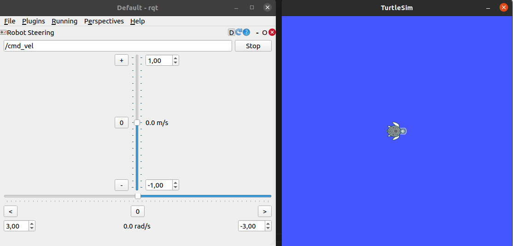
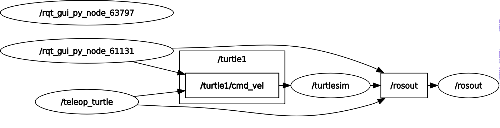

# Controlando a TurtleSim

## Ferramenta 'rqt' (ROS Qt-based framework) 
Essa ferramenta vai ser um novo nó. 
O significado: 
- ROS: sistema de robótica
- Qt: biblioteca gráfica (usada para criar interfaces)
- framework: estrutura para construir ferramentas

Nós publicamos anteriormente com o comando `rostopic pub...`, porém, também é possível publicar usando a ferramenta: `rqt` (pelo novo nó). 
O rqt é uma ferramenta gráfica do ROS que permite visualizar e interagir com o sistema sem precisar ficar só no terminal, isto é, o rqt é como um painel de controle do ROS. 
A ferramenta rqt possui múltiplas funcionalidades, e a mais básica é publicar em um tópico do tipo /cmd_vel (mensagem do tipo geometry_msgs/Twist)
Para abrir a ferramenta, basta rodar o comando: 
```bash
rqt
```

Vá no canto superior esquerdo --> Plugins --> Robot Tools --> Robot Steering.
Na barra de tópicos (como se fosse uma barra de pesquisa), colocar o tópico `/turtle1/cmd_vel`.


Se mexermos no controle e analisarmos as mensagens publicadas por `rostopic echo /turtle1/cmd_vel`, podemos ver as mensagens trocadas no tópico */turtle1/cmd_vel* entre o nó */turtlesim* e o rqt, representado pelo nó */rqt_gui_py_node_55802*. 

## Outro nó capaz de controlar a turtle que também escreve no "/turtle1/cmd_vel". 
```bash
rosrun turtlesim turtle_teleop_key
```
Esse nó permite que controlemos a turtle pelo teclado.

**OBS:** O turtlesim_teleop_key só funciona se o terminal onde ele está rodando estiver em foco

## E para saber qual Nó está publicando/subscrevendo em qual tópico de forma gráfica? 
Também é com a ferramenta `rqt`. Para isso, basta rodar o comando:
```bash
rqt_graph
```
Essa ferramenta, quando executada, varre a rede do ROS e verifica todos os nós e tópicos que estão ativos.

## Analisando um fluxo de dados
Quando rodamos o comando:
```bash
`rosrun turtlesim turtlesim_node`
```
Além de serem criados alguns tópicos, como o */turtle1/cmd_vel*, também iniciamos a turtle de forma gráfica. 
Para movimentar a turtle podemos iniciar dois novos nós:
```bash
# Nó 1:
rqt # Representado pelo nó rqt_gui_py_node_55802

# Nó 2:
rosrun turtlesim turtle_teleop_key
```

Diante disso, se analisarmos o tópico */turtle1/cmd_vel* com:
```bash
rostopic info /turtle1/cmd_vel
```
Veremos que tanto o Nó 1 quando o Nó 2 estão publicando dados por esse tópico para o Nó */turtlesim*.

Utilizando o `rqt_graph`, podemos ver isso de maneira gráfica. 

