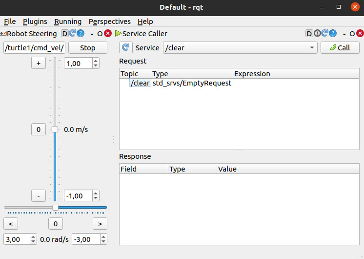

# Serviços e Parâmetros

No ROS, além da comunicação contínua via tópicos, existe uma segunda forma fundamental de interação entre nodes: os **serviços**. Diferente dos tópicos, que funcionam como um fluxo contínuo de dados, os serviços seguem o modelo de **requisição e resposta**, sendo utilizados quando se deseja executar uma ação pontual. 
Em paralelo, o ROS também fornece um mecanismo chamado **Parameter Server**, que permite armazenar e gerenciar configurações globais acessíveis por todos os nodes. 

## Serviços

Um serviço no ROS é composto por dois elementos: um **request** (requisição) e um **response** (resposta). Um node pode atuar como servidor, oferecendo um serviço, enquanto outro node atua como cliente, chamando esse serviço e aguardando o retorno.
Para explorar os comandos disponíveis:
```bash
rosservice <tab> <tab>
```

1) Para listar todos os serviços: 
```bash
rosservice list
```
Esse comando mostra todos os serviços registrados no ROS Master naquele momento.

2) Para obter a informação de algum serviço
```bash
rosservice info </nome_serviço>
```
Esse comando revela qual node está oferecendo o serviço, o tipo do serviço e os argumentos envolvidos. 
**Por exemplo:**
```bash
rosservice info /reset 

Node: /turtlesim
URI: rosrpc://pedro-Aspire-A515-54G:35985
Type: std_srvs/Empty
Args: 
```
retorna que o serviço `/reset` pertence ao node `/turtlesim`, possui o tipo `std_srvs/Empty` e não recebe argumentos. Esse serviço, ao ser chamado, reinicia o ambiente do turtlesim.

Uma vez que temos um serviço, podemos chamar ele para executar o que ele nasceu para fazer, no caso do `/reset`, é limpar o ambiente e a trocar a turtle. 

3) Para chamar um serviço:
```bash
rosservice call </nome_serviço>
```
**Exemplo:**
Com o Nó da turtle rodando, vamos mudar ela de posição com o serviço /turtle1/teleport_absolute. 
```bash
rosservice call /turtle1/teleport_absolute "x: 5.0     
y: 2.0
theta: 1.57" 
```
Isso faz a turtle teleporta para as coordenadas indicadas. 

### Tipos de serviços

O tipo define a estrutura dos dados envolvidos na comunicação.
Podemos ver a estrutura dos serviços, ou seja, quais campos existem no request e quais campos existem na response. 
Para explorar os tipos de serviços disponíveis:
```bash
rossrv <tab> <tab> 
```

4) Listar todos os tipos de serviços que tem no ROS:
```bash
rossrv list
```

5) Visualizar a estrutura de um serviço:
```bash
rossrv show <type>
```

**Por exemplo:** 
```bash
rossrv show turtlesim/TeleportAbsolute 

float32 x
float32 y
float32 theta
---
```
A parte acima da linha `---` representa o **request**, enquanto a parte abaixo representa o **response**. Nesse caso, o serviço recebe três parâmetros e não retorna valores.

---
##### OBS: 
O type do serviço é diferente do nome do serviço, por exemplo: 
```bash
rosservice info /turtle1/teleport_absolute 

Node: /turtlesim
URI: rosrpc://pedro-Aspire-A515-54G:35985
-> Type: turtlesim/TeleportAbsolute
Args: x y theta

# Agora podemos, com o tipo do serviço, saber a estrutura dele:
rossrv show turtlesim/TeleportAbsolute 

float32 x
float32 y
float32 theta
---
```

---

Com o turtlesim, podemos spawnar mais turtles com:
```bash
rosservice call /spawn "x: 0.0
y: 0.0
theta: 0.0
name: 'nome da turtle'" 
```

#### Uso da ferramenta rqt para serviços
Além da linha de comando, podemos utilizar a ferramenta gráfica **rqt**, que permite interagir com serviços de forma visual:
Podemos usa o rqt para chamar serviços: 
```bash
rqt
```
--> Plugins --> Services --> Service Caller




## Parâmetros
O ROS possui um **servidor de parâmetros**, que funciona como um armazenamento global de configurações. Esses parâmetros podem ser acessados e modificados por qualquer node, permitindo ajustar o comportamento do sistema sem alterar o código. 
Para verificar todas as possibilidades de comandos relacionado aos parâmetros:
```bash
rosparam <tab> <tab>
```

1) Verificar a lista de todos os parâmetros:
```bash
rosparam list
```

2) Obter o valor de um parâmetro:
```bash
rosparam get </nome_parâmetro>
```

3) Setar o valor de um parâmetro:
```bash
rosparam set </nome_parâmetro> <valor>
```

4) Ver e Salvar todos os parâmetros do ROS:
```bash
# Para ver
rosparam dump

# Para salvar em um arquivo
rosparam dump params.yaml
```

5) Carregar um arquivo com os parâmetros:
```bash
rosparam load params.yaml
```