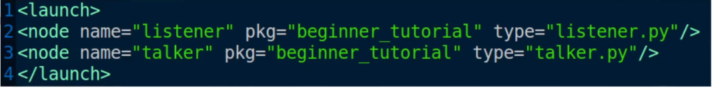

# ROSLAUCH

O **roslaunch** é uma ferramenta do ROS utilizada para iniciar **múltiplos nodes de forma automatizada e organizada**, a partir de um único comando. Ele resolve um problema comum no uso do ROS:
- a necessidade de abrir vários terminais e executar manualmente cada node com `rosrun`.

Diferente do que foi descrito inicialmente, ao usar `roslaunch` **não é necessário executar manualmente o `roscore`**, pois ele já inicia o ROS Master automaticamente caso ainda não esteja rodando. Isso torna o processo mais simples e menos propenso a erros.

#### Ideia geral
O funcionamento do `roslaunch` é baseado em um arquivo com extensão `.launch`, que utiliza a linguagem **XML** para descrever quais nodes devem ser executados, com quais configurações e parâmetros.
Esse arquivo normalmente é colocado dentro de uma pasta chamada `launch` dentro de um pacote ROS.


## Passos

#### Configuração de ambiente
**É muito importante lembrar que SEMPRE que iniciar o novo terminal ao entrar na pasta do workspace (catkin_ws) executar o comando:**
```bash
source devel/setup.bash
```
Até porque, se não o ROS não vai identificar os pacotes da pasta. 

#### Criação de um launchfile
1) Criar (se não existir) a pasta "launche" no pacote:
```bash
roscd <nome_pacote>
mkdir launch
```

2) Criar o arquivo com extensão ".launch" na pasta criada: 
```bash
cd launch
touch <nome>.launch
gedit <nome>.launch
```

3) Executar (lançar) os nós com o comando: 
```bash
roslaunch <nome_pacote> <nome_do_launchfile> 
```
Ao executar esse comando, o ROS:
- inicia o ROS Master (se necessário)
- inicia todos os nodes definidos no arquivo
- gerencia automaticamente o ciclo de vida desses nodes

**Qual é a utilidade do launchfile?**
Ao invés de abrir um terminal para cada nó, teremos tudo isso em um terminal. Além disso, ele mesmo inicia o roscore se não estiver iniciado. 

## Estrutura do arquivo .launch
Esse arquivo é do tipo XML-eXtended Markup Language (linguagem de Marcações - tags - Extendida)

Dentro dele, definimos os nodes que queremos executar.

Temos dois tipos de tags:
1) Abertura com \<nome_da_tag> e fechamento com \</nome_da_tag>
2) Tag única: \<nome_tag ...parâmetros... />

No caso mais comum, utilizamos a tag `<node />` para iniciar nodes.

**ATENÇÃO:** O launchfile precisa ter extensão .launch e precisa começar com a tag \<launch> na primeira linha, e finalizar com a tag \</launch> na última linha.

Podemos colocar várias "coisas" no launchfile, porém vamos falar hoje sobre o node. 
Dessa forma, para cada tag \<node ...parâmetros... />, os parâmetros mínimos (obrigatórios) são:
- `name = "nome_do_nó_após_lançado"`: Nome do nó lançado. 
- `pkg = "nome_do_pacote"`: nome do pacote onde está esse nó. 
- `type = "nome_do_nó_original"`:nome usado no rosrun. 

Depois, só executar os nós com o comando:
```bash
roslaunch <nome_pacote> <nome_do_launchfile> 
```

## Exemplo:
No nosso exemplo, teremos o launchfile com os seguintes parâmetros: 

```xml
<launch>
<node name = "listener" pkg = "beginner_tutorial" type = "listener.py" output = "screen" />
<node name = "talker" pkg = "beginner_tutorial" type = "talker.py" output = "screen" />
</launch>
```
Nesse caso, dois nodes serão executados simultaneamente: o `talker` e o `listener`.

OBS: O parâmetro "output": output = "log|screen", é um parâmetro opcional, mas sem esse, a saída de um nó será escrita no arquivo de log em $ROS_HOME/log (usualmente a pasta .ros/log do usuário, um arquivo para cada node)

**Executar:**
```bash
roslaunch begginer_tutorial \<nome>.launch
``` 